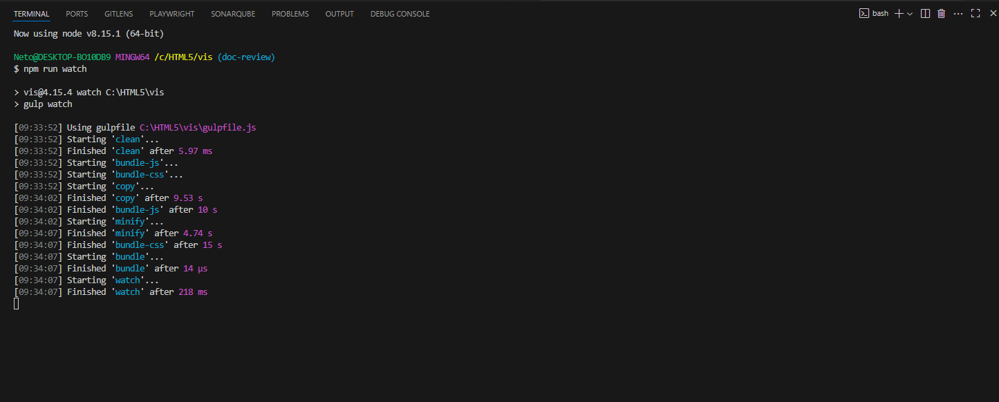
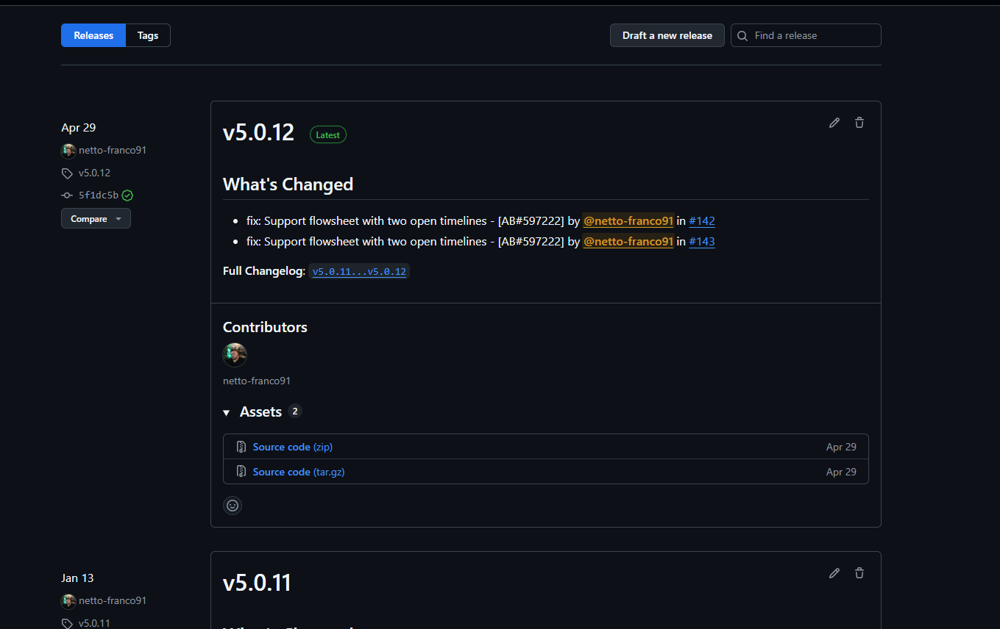

# Environment Requirements

This guide will help you set up your environment to run the EMR-VIS.js project. The project uses Node 8.15.1, and we'll explain how to run multiple versions of Node on your machine using NVM, as well as how to update the framework with the updated VIS version locally.

## Installing NVM and Node 8.15.1

The first thing we need to build VIS on our machine is to install NVM and Node 8.15.1.

To install Node, we need to check a few things on our machine:
- Check the Git version.
- Check if git\bin\git-core is in the environment variables.
- Clear the Node cache.
- Delete all Node versions.
- Install NVM for Windows using the link: https://github.com/coreybutler/nvm-windows.
- Install Node using NVM, with the following commands:

```javascript
// This command checks the Nodes installed on the machine
nvm list
// Install the desired version
nvm install 8.15.1
// To use the desired version of Node
nvm use 8.15.1
```

## Running the VIS
Currently, VIS is only configured to run embedded in the Framework. This means we can't run it independently in the project by running `npm run`, for example.

To build VIS, we'll use the command:
```javascript
npm run watch
```
If everything is correctly configured, any changes made to the VIS code will automatically rebuild the project, thus always generating an updated build, and the result of the command above will be this:



## Updating the Local Framework
The process of updating the Framework with the changed VIS version locally is completely manual, but easy to execute. Just follow these steps:

- First you must have run VIS with the `npm run watch` command and have had the result explained above.
- Locate the VIS folder on your computer and enter the `dist` folder, example path: `C:\HTML5\vis\dist`
- Copy the entire contents of the folder with `ctrl+c` and overwrite the files in the framework's `dist` folder in the path: `C:\HTML5\emr-tasy-framework\packages\framework\node_modules\vis\dist`
- Once this is done, you can upload the Framework and view your changes.

## Create PR
ℹ️ **ALWAYS open a PR from the branch: `version-flowsheet-v3.0.0.0.`**

To create a PR for VIS we use the pattern established in ['Git - Commit Patterns'](https://share.philips.com/sites/ArchitectureInnovation/SitePages/Git---Commit-Patterns.aspx).

It is very important that the PR is sent along with the changes to the files that were made: `dist/vis.css, dist/vis.js, dist/vis.map, dist/vis.min.js` and any other file in the `**DIST**` folder that is automatically changed when running `npm run watch`, [example of PR](https://github.com/philips-emr/vis/pull/143).


## Generating version
To generate the version we are doing a process, using 'Releases' and generating tags when necessary, below is a list of Releases.



To create a new release, first check that all PRs have been merged and that all changes are correct.
Fill in the fields by creating a new tag, the `Release title` with the same name as the tag, and click the `Generate release notes` button.
The result will be something similar to the image below:
_**Finally, click the `Publish release` button.**_


## Updating Framework to Publish
After generating a new version for VIS, we'll need to modify the `'package-lock.json' and 'package.json'` files in the Framework so it pulls in this new version.

To execute this process, we'll need to modify the files `('package-lock.json' and 'package.json')` with the new tag information and the merge hash created by GitHub, [following the standard of this PR](https://github.com/philips-internal/emr-tasy-framework/pull/30270/files).